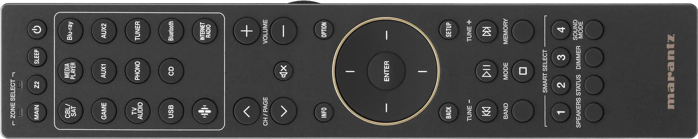
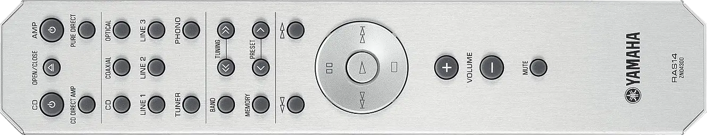
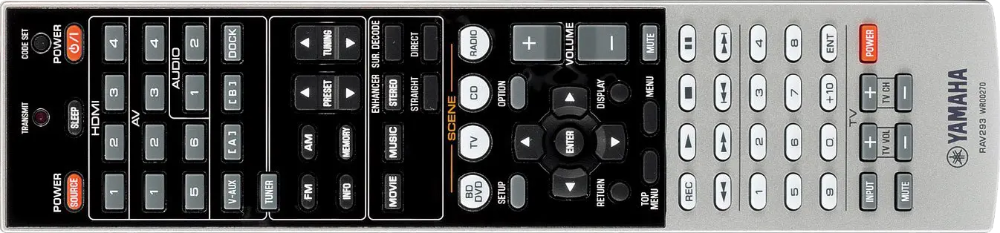

 RemoteControl
===

*Control media programs on a PC using the buttons on your AV receiver's remote control.*

If you have an AV or audio receiver or amplifier, you probably have a remote control with a bunch of transport buttons like ⏯, ⏮, ⏭, and ⏹. Unless you have a CD or DVD player from the same manufacturer, those transport buttons won't do anything. With this program and a USB infrared receiver, you can make those buttons control media playback in several programs. This is useful if you use a computer to stream video or as an audio source for a hi-fi stereo with passive speakers, or if you just want to control your computer with a remote.

<!-- MarkdownTOC autolink="true" bracket="round" autoanchor="false" levels="1,2" bullets="1.,-,-" -->

1. [Prerequisites](#prerequisites)
1. [Installation](#installation)
1. [Configuration](#configuration)
1. [Running](#running)
1. [Usage](#usage)
1. [Tips](#tips)

<!-- /MarkdownTOC -->

<br>
<br>


## Prerequisites
- Infrared remote control
    - Tested with the [RC052SR](https://images.crutchfieldonline.com/ImageHandler/trim/3000/1950/products/2023/34/642/g642STR70SB-o_other2-1.jpg) from a [Marantz Stereo 70s](https://www.marantz.com/en-us/product/system-products/stereo-70s/300789.html)
    - You can use any IR remote, because you train the IR receiver on the unique IR pulse patterns of your individual remote
- [Flirc USB](https://flirc.tv/products/flirc-usb-receiver) infrared receiver ([Amazon](https://www.amazon.com/gp/product/B01NBRBWS6/), [Vilros](https://vilros.com/products/flirc-usb-gen2))
- Flirc GUI program for training
    - Required during setup only, and can be uninstalled after IR training is complete
    - Download from the botton of the [product page](https://flirc.tv/products/flirc-usb-receiver)
- [.NET 8 Desktop Runtime and ASP.NET Core Runtime](https://dotnet.microsoft.com/en-us/download/dotnet/8.0) or later
- One or more programs to control
    - [Vivaldi](https://vivaldi.com/desktop/) or other Chromium-based browser. Media control is supported on
        - [Twitch](https://www.twitch.tv/)
        - [YouTube](https://www.youtube.com)
    - [VLC](https://www.videolan.org/vlc/)
    - [Winamp](https://forums.winamp.com/forum/winamp/winamp-discussion/306661-winamp-5-666-released-build-3516)

## Installation
1. Download [**RemoteControl.zip**](https://github.com/Aldaviva/RemoteControl/releases/latest/download/RemoteControl.zip) from the [latest release](https://github.com/Aldaviva/RemoteControl/releases/latest/).
1. Extract the ZIP file to a directory like `C:\Program Files\RemoteControl\`.
    - When upgrading an existing installation, don't overwrite `appsettings.json`.
1. Install the browser extension.
    1. Go to `chrome://extensions`.
    1. Enable Developer Mode.
    1. Drag and drop `RemoteControl.crx` into the Extensions page.

## Configuration
### Infrared remote training
1. Plug the Flirc USB IR receiver into a computer
    - It doesn't have to be trained on the same computer that it will later run on, because the training data is stored in the receiver hardware and not the software, which isn't even used after training.
1. Start the Flirc GUI.
1. If prompted to install a firmware update, choose yes.
1. Select Controllers › Full Keyboard.
1. Train all remote control buttons.
    1. Use the on-screen keyboard to click each of following keyboard shortcuts.
    1. After clicking each shortcut, like <kbd>Ctrl</kbd>+<kbd>Alt</kbd>+<kbd>Shift</kbd>+<kbd>F5</kbd>, aim the remote control at the Flirc, and press the corresponding button, like Channel Up.
    1. Train each button twice, because IR remotes send different pulse codes every other time to distinguish between double presses and interrupted beams (occlusion).
1. Test the remote control buttons by pressing them and watching the on-screen keyboard light up green.

|Keyboard shortcut|Remote control button|
|-|-|
|<kbd>Ctrl</kbd>+<kbd>Alt</kbd>+<kbd>Shift</kbd>+<kbd>F5</kbd>|🔼 Channel Up|
|<kbd>Ctrl</kbd>+<kbd>Alt</kbd>+<kbd>Shift</kbd>+<kbd>F6</kbd>|🔽 Channel Down|
|<kbd>Ctrl</kbd>+<kbd>Alt</kbd>+<kbd>Shift</kbd>+<kbd>F7</kbd>|⏮ Previous Track|
|<kbd>Ctrl</kbd>+<kbd>Alt</kbd>+<kbd>Shift</kbd>+<kbd>F8</kbd>|⏯ Play/Pause|
|<kbd>Ctrl</kbd>+<kbd>Alt</kbd>+<kbd>Shift</kbd>+<kbd>F9</kbd>|⏭ Next Track|
|<kbd>Ctrl</kbd>+<kbd>Alt</kbd>+<kbd>Shift</kbd>+<kbd>F10</kbd>|📻 Band|
|<kbd>Ctrl</kbd>+<kbd>Alt</kbd>+<kbd>Shift</kbd>+<kbd>F11</kbd>|⏹ Stop|
|<kbd>Ctrl</kbd>+<kbd>Alt</kbd>+<kbd>Shift</kbd>+<kbd>F12</kbd>|🧠 Memory|

### VLC
1. Start VLC.
1. Go to Tools › Preferences.
1. Change Show settings from Simple to **All**.
1. Go to Interface › Main interfaces.
1. Enable **Web**.
1. Go to Interface › Main interfaces › Lua.
1. Create a password and type it into Lua HTTP › Password.
1. Restart VLC twice, allowing the Windows Defender Firewall prompt each time.
1. Edit `appsettings.json` in the RemoteControl installation directory.
1. Set the password you just created in the `vlc.password` field.
1. Save `appsettings.json`.

### Autorun
To make this program start automatically when you log into Windows, add a registry value by running the following command in Command Prompt.
```bat
reg add HKCU\Software\Microsoft\Windows\CurrentVersion\Run /v RemoteControl /d """C:\Program Files\RemoteControl\RemoteControl.exe"""
```

## Running
1. Run `RemoteControl.exe`.
1. Either restart the browser or reenable the browser extension, because Chromium will suspend the extension if `RemoteControl.exe` wasn't running for more than 30 seconds.

## Usage
This is what the remote control buttons do, depending on which program is active, based on which one is playing, focused, or just running.
<table>
    <thead><th>Remote control button</th><th>Winamp</th><th>VLC</th><th>Twitch</th><th>YouTube</th></thead>
    <tr><td>🔼 Channel Up</td><td colspan="2"><em>unused</em></td><td colspan="2">Previous tab</td></tr>
    <tr><td>🔽 Channel Down</td><td colspan="2"><em>unused</em></td><td colspan="2">Next tab</td></tr>
    <tr><td>⏯ Play/Pause</td><td colspan="4">Play/pause</td></tr>
    <tr><td>⏮ Previous Track</td><td>Previous track</td><td colspan="3">Seek backwards</td></tr>
    <tr><td>⏭ Next Track</td><td>Next track</td><td colspan="3">Seek forwards</td></tr>
    <tr><td>📻 Band</td><td><em>unused</em></td><td>Show time</td><td colspan="2"><em>unused</em></td></tr>
    <tr><td>⏹ Stop</td><td colspan="2">Stop</td><td colspan="2">Pause</td></tr>
    <tr><td>🧠 Memory</td><td><em>unused</em></td><td colspan="3">Toggle fullscreen</td></tr>
</table>

## Tips
- The IR USB receiver can be repositioned using a USB extension cable if your computer's USB ports don't have line of sight to where you'll be firing the remote from, for example, if the computer sits behind or underneath a desk or inside a TV console table.
